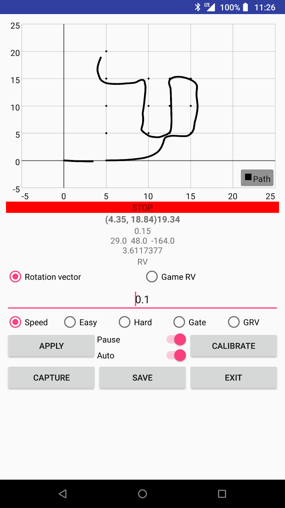

 Map tracing tool using motion sensors inside an android smartwatch
=============
 
 - This project is a tool for pedestrian dead-reckoning system using smartwatch.
 - I proposed the system that provide a pedestrian deak-reckoning serivce to user.
 - The system needs rotation vector sensor or game rotation vector.
 
Author: Jun Sung Kim (jskim.uoscs@gmail.com) 

### Used Library

 - GraphView ; http://www.android-graphview.org/ ; Apache v2 license

### Functions

 - You can connect your android smartwatch with your android smartphone.
 - You can choose a sensor between rotation vector sensor and game rotation vector sensor.
 - You can configure map data (with nodes and edges) for correcting the pedestrian's position.
 - This project contains capturing sensor data (rotation vector sensor, game rotation vector sensor).
 
### Screenshot

